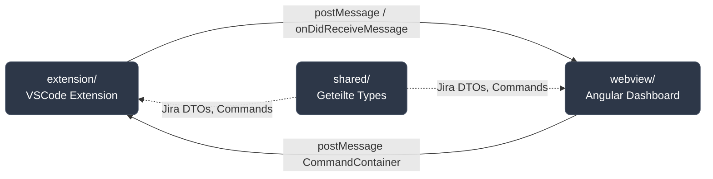

# TimeTracker VSCode Extension — Übersicht

## Was ist das?

Eine VSCode-Extension, die Jira-Issues direkt im Editor anzeigbar macht und Zeittracking ermöglicht — ohne Browser-Wechsel. Die Extension öffnet ein **Webview-Panel** (Dashboard), das Issues lädt, den Status und verbrauchte Zeit anzeigt und Zeit-Einträge erfasst.

---

## Paket-Struktur

Die Codebasis besteht aus drei Paketen:



| Paket          | Technologie                     | Zweck                                                                                                      |
| -------------- | ------------------------------- | ---------------------------------------------------------------------------------------------------------- |
| **extension/** | TypeScript · esbuild · tsyringe | VSCode-Erweiterung: Command-System, Jira-Integration, Webview-Panel-Management                             |
| **webview/**   | Angular 22 · RxJS               | Dashboard-UI: Issues anzeigen, Zeit tracken, interaktive Tabelle mit Status-Farben                         |
| **shared/**    | TypeScript                      | Geteilte Typ-Definitionen: Jira-DTOs, Command-Types, Mappings — wird von Extension **und** Webview benutzt |

---

## Webview (Angular 22)

Das Dashboard ist eine Angular-Applikation mit:

- **VsCodeBridgeService** — zentraler Service für Extension-Kommunikation
  - `request<T>(command)` → Observable mit Ergebnis
  - UUID-basiertes Response-ID Matching
  - Error-Handling (throws bei code > 0)
- **RxJS Resources** (`rxResource`) — automatisches Loading/Refetching
- Components konsumieren Commands über Services (nicht direkt)

**Best Practices:**

- ✅ Commands über Services kapseln
- ✅ `rxResource` für Loading-States
- ✅ Immer Error-Handler implementieren
- ❌ Keine direkte `acquireVsCodeApi()` in Components

---

## Extension (TypeScript)

Die Extension läuft im VSCode-Prozess und ist das Rückgrat: Command-System, Jira-Integration, Webview-Panel.

- **Entry Point** — `src/timetracker.ts`: Initialisiert DI-Container, importiert Module, registriert das Webview-Command
- **Module Loader** — `src/module.ts`: Importiert Business-Module (`@module/jira`), über `@RegisterCommand` werden Handler automatisch registriert
- **Core** — `core/`: CommandController, CommandRegistry, SettingsService, NotificationService, Exceptions — die Grundbausteine
- **Jira-Modul** — `module/jira/`: `JiraSearchRepository` (Business-Logik, JQL-Queries), `JiraApiClient` (axios HTTP-Client), Command-Handler (`jira:get-issues`, `jira:get-focus-task`)
- **Webview-Modul** — `module/webview/`: Erstellt das VSCode-Panel, routet Commands zur Extension, sendet Responses zurück

**Best Practices:**

- ✅ Handler sind dünn — Business-Logik im Repository
- ✅ `@RegisterCommand` Decorator → keine manuelle Registrierung
- ✅ Error Handling im Repository/API, nicht im Handler
- ❌ Keine UI-Logik in der Extension
- ❌ Keine Settings direkt lesen — über `SettingsService`

---

## Shared (TypeScript)

Das Shared-Paket enthält Typ-Definitionen, die von Extension **und** Webview gemeinsam genutzt werden — keine Laufzeit-Logik, nur Interfaces und Types.

- **Jira DTOs** — `src/lib/jira/`: Rohdaten-Formate aus der Jira REST API (`JiraIssueListItemDTO`, `JiraIssueDTO`)
- **Domain Models** — `src/lib/jira/`: Saubere Interfaces ohne Jira-Spezifika (`JiraIssueListItem`, `JiraIssue`) mit gemappten Status/Types
- **Command-Types** — `src/lib/jira/`: Typisierte Command-Typen (`GetIssuesCommand`, `CreateTimeEntryCommand`) für typsichere Kommunikation
- **Mappings** — `src/lib/jira/`: `IssueType` ("BUG" | "FEATURE"), `IssueStatus` ("TO_DO" | "IN_PROGRESS" | "TEST" | "DONE") als Standardisierungsschicht

**Best Practices:**

- ✅ Nur Typen, keine Funktionen oder Klassen
- ✅ Ein Source of Truth für beide Seiten
- ✅ Neue Commands hier definieren und von Extension + Webview referenzieren
- ❌ Keine Business-Logik
- ❌ Keine Abhängigkeiten zu VSCode- oder Angular-Code

---

## Build & Entwicklung

```bash
npm install
npm run extension:build    # Extension kompilieren
npm run webview:build      # Angular bundle
npm run extension:watch    # Extension Watch-Mode
cd webview && npm run start # Angular HMR-Server
```

Die Extension nutzt **esbuild** für schnelles Kompilieren, der Webview ist eine standard Angular CLI Applikation.

---

## Quickstart

1. Jira-Einstellungen konfigurieren (VSCode Settings)
2. `F5` in VSCode drücken (Debug-Session)
3. Command Palette → "timetracker.openWebview"
4. Dashboard zeigt Issues aus Jira

---

## Bekannte Probleme (aus Code)

- `ERROR_CODE` Enum enthält nur `TIMEOUT` — 10000/12000 sollten ergänzt werden
- `BaseException` constructor Parameter `e` wird als `error` getter gelesen, aber nicht weiterverarbeitet
