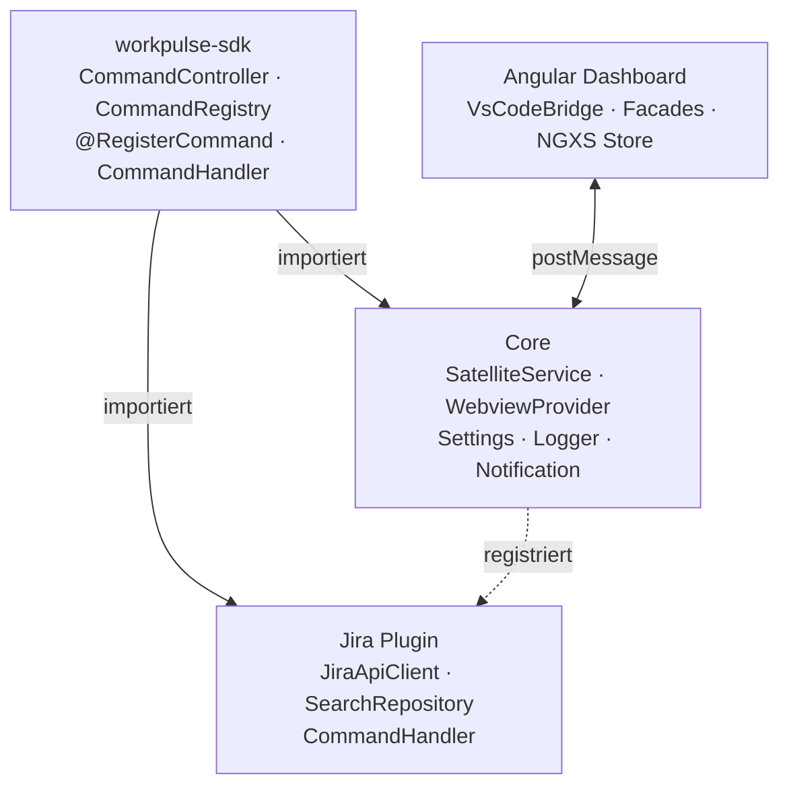
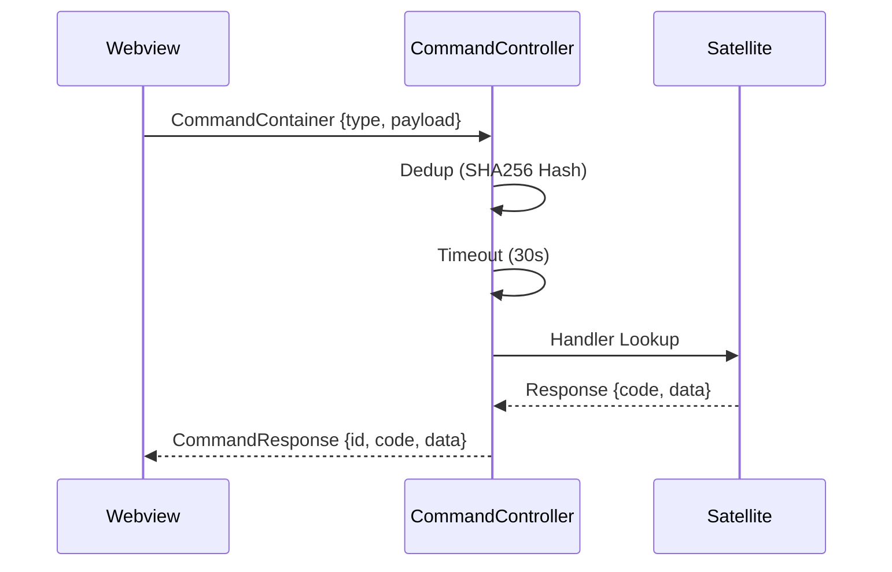
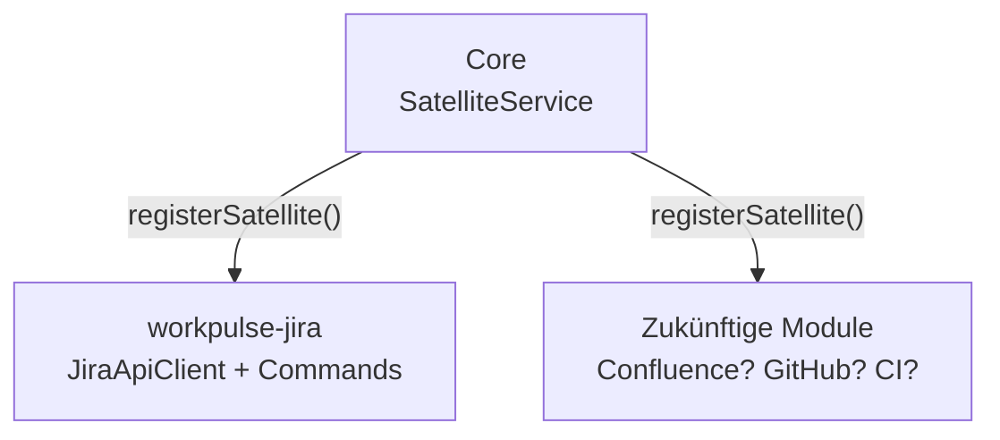

# Workpulse

> Zeit für Jira-Tasks tracken – direkt aus VS Code, ohne Browser-Wechsel.

---

## Was ist Workpulse?

Workpulse ist eine **VS Code Extension**, mit der du deine Zeit für Jira-Tasks trackst – ohne zum Browser wechseln zu müssen. Du bist im Editor, klickst auf "Workpulse öffnen", siehst deine Tasks, startest den Timer. Fertig.

Es basiert auf einem **extensiblen Plugin-System**: Der Core bringt alles, was jede Extension braucht. Jira ist das erste Plugin – weitere könnten folgen.

## Projekt-Struktur

```
workpulse/          → VS Code Extension Core (Fundament)
workpulse-jira/     → Jira-Plugin (registriert sich am Core)
workpulse-webview/  → Angular Dashboard (wird im VS Code Panel angezeigt)
workpulse-sdk/      → SDK zum Entwickeln eigener Workpulse-Extensions
api/                → Shared Types (Commands, DTOs, Mappings)
```

### workpulse – Der Core

Das Fundament. Bringt das Command-System, das Webview-Panel und die Satellite-Registry. Kann aber **gar nichts ohne Plugins** – die Core-Extension macht erst durch die Satelliten Sinn.

### workpulse-jira – Das Jira-Plugin

Registriert sich als Satellite am Core und bringt die Jira-Integration:
- Lädt deine offenen Tasks aus Jira
- Zeigt den Focus-Task (aktiv "In Progress")
- Issue-Details, Status, verbrauchte Zeit
- Zeit-Tracking für einzelne Tasks

### workpulse-webview – Das Dashboard

Eine Angular-Applikation, die als Panel in VS Code angezeigt wird. Zeigt Issues, Timer, Timesheet – alles interaktiv.

### workpulse-sdk – Das SDK

Paket zum Entwickeln eigener Workpulse-Extensions. Bringt Command-System und DI-Infrastruktur.

### @workpulse/api – Shared Types

Geteilte Typ-Definitionen zwischen Extension und Webview – keine Laufzeit-Logik, nur Interfaces und Commands.

## Architektur



### Command-System

Die gesamte Kommunikation zwischen Webview und Core läuft über typsichere Commands. CommandController, Registry und Decorator kommen aus **workpulse-sdk** und werden von Core sowie Satellite importiert.



Satellite-Plugins registrieren sich via `@RegisterCommand`-Decorator und sind sofort verfügbar.

### Satellite-System

Jira hängt sich als Satellite am Core heran. Das Plugin-System (`SatelliteService`) erlaubt es, beliebige Module zu registrieren – ohne den Core anzufassen. Designed für Erweiterungen wie Confluence, GitHub oder CI-Pipelines.



## Installation & Setup

### Voraussetzungen

- VS Code >= 1.105.0
- Node.js >= 18
- Jira-Instanz mit API-Zugang

### 1. Dependencies installieren

```bash
npm install
```

### 2. Bauen

```bash
npm run build
# Baut: SDK → API → Webview → Extensions
```

### 3. In VS Code starten

```bash
code .
F5            # Debug-Session startet die Extension
```

## Konfiguration

### Entwicklung

`.vscode/launch.template.json` nach `.vscode/launch.json` kopieren und die Jira-Daten anpassen:

```json
"env": {
  "JIRA_API_URL": "https://deine-jira.company.com",
  "JIRA_API_TOKEN": "dein-api-token",
  "JIRA_USER_NAME": "deine-email@example.com",
  "JIRA_PROJECT_KEY": "PROJEKTKEY"
}
```

### Produktion

Die Jira-Daten in den VS Code Einstellungen konfigurieren:

```
workpulse.JIRA_API_URL      → https://deine-jira.company.com
workpulse.JIRA_API_TOKEN    → dein-api-token
workpulse.JIRA_USER_NAME    → deine-email@example.com
workpulse.JIRA_PROJECT_KEY  → PROJEKTKEY
```

Optional: Status- und Issue-Type Mappings anpassen:
- `workpulse.STATUS_MAPPING` – Jira-Status zu internen Zuständen mappen
- `workpulse.ISSUE_TYPE_MAPPING` – Jira-Ticket-Typen zu BUG/FEATURE mappen

## Verwendung

1. `Ctrl+Shift+P` / `Cmd+Shift+P`
2. **"Workpulse: open webview"**
3. Dashboard öffnet sich – Issues werden geladen, Timer starten

## Entwicklung

### Webview Dev-Server

```bash
cd workpulse-webview && npm start
# Angular HMR auf localhost:4200
```

### Extension Watch-Mode

```bash
npm run extension:watch
```

## Lizenz

MIT – Ralf Hannuschka
