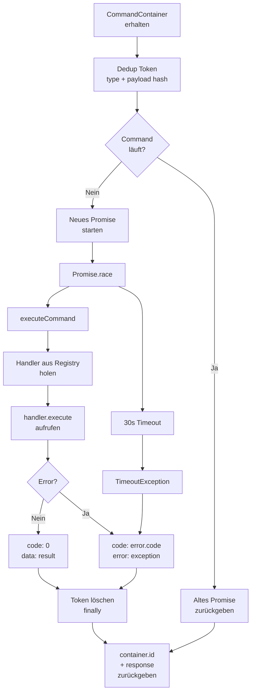

# Commands Dokumentation

Übersicht über das Command-System der TimeTracker Extension.

---

## Inhaltsverzeichnis

1. [Wie Commands gehandelt werden](#wie-commands-gehandelt-werden)
2. [Ein neues Command erstellen](#ein-neues-command-erstellen)
3. [Commands aufrufen](#commands-aufrufen)
4. [Best Practices](#best-practices)

---

## Wie Commands gehandelt werden

### Ablauf im Detail

#### 1. **Command wird ausgelöst**

Commands werden über `CommandController.exec()` ausgelöst. Der Command muss in einen `CommandContainer` gepackt werden:

```typescript
const command: Command = {
  type: "jira:get-issues"
};

const container: CommandContainer = {
  id: crypto.randomUUID(),
  command
};

const result = await commandController.exec(container);
```

Oder kürzer mit dem Helper:

```typescript
import { createCommandContainer } from "@core/command";

const result = await commandController.exec(
  createCommandContainer({ type: "jira:get-issues" })
);
```

#### 2. **CommandController verarbeitet**

`CommandController.exec()` macht folgendes:



**Was passiert:**

- **Deduplication:** Wenn der gleiche Command (Type + Payload) noch läuft, wird das laufende Promise wiederverwendet (nicht zweimal ausgeführt)

- **Timeout-Schutz:** Command hat max. 30 Sekunden. Länger → `TimeoutException` mit code 500

- **Error Handling:** Exceptions werden in `CommandErrorResponse` gewrapped mit ihrer `error.code`

- **Response ID:** Jeder Caller bekommt seine `container.id` in der Response zurück (für Zuordnung im Webview)

#### 3. **Handler wird ausgeführt**

`CommandRegistry` holt den registrierten Handler und instanziiert ihn:

```typescript
const commandEntity = this.commandRegistry.get("fetch:jira-data");
const handlerInstance = new commandEntity(command);
const result = await handlerInstance.execute();
```

#### 4. **Response zurückgegeben**

```typescript
// Success (code = 0)
{
  code: 0,
  data: { /* dein result */ }
}

// Error (code != 0)
{
  code: 500,
  error: Error
}
```

---

## Ein neues Command erstellen

### Schritt 1: CommandHandler definieren

Erstelle eine neue Datei: `src/core/command/src/handlers/fetch-jira.handler.ts`

```typescript
import { RegisterCommand } from "@core/command";
import type { CommandHandler } from "@core/command";

interface FetchJiraCommand {
  type: "fetch:jira-data";
  payload: {
    projectKey: string;
  };
}

interface JiraData {
  issues: any[];
  count: number;
}

@RegisterCommand("fetch:jira-data")
export class FetchJiraHandler implements CommandHandler<JiraData> {
  constructor(private command: FetchJiraCommand) {}

  async execute(): Promise<JiraData> {
    const { projectKey } = this.command.payload;

    // Deine Logik hier
    const data = await this.fetchFromJira(projectKey);

    return data;
  }

  private async fetchFromJira(projectKey: string): Promise<JiraData> {
    // API-Aufruf, Datenbankquery, Dateioperationen, etc.
    return { issues: [], count: 0 };
  }
}
```

### Schritt 2: Decorator `@RegisterCommand`

Der `@RegisterCommand("fetch:jira-data")` Decorator registriert automatisch:

```typescript
export function RegisterCommand(domain: string) {
  return function (ctor: CommandHandlerConstructor<any>) {
    const registry = container.resolve(CommandRegistry);
    registry.register(domain, ctor);
  };
}
```

**Du brauchst NICHT manuell zu registrieren** - der Decorator macht das!

### Schritt 3: Exportieren

In `src/core/command/index.ts`:

```typescript
export * from './src/handlers/fetch-jira.handler';
```

### Fertig! ✅

Der Handler ist jetzt registriert und kann überall aufgerufen werden.

---

## Commands aufrufen

### Von überall in der Extension

```typescript
import { CommandController, createCommandContainer, isErrorResponse } from "@core/command";

// Injiziere CommandController
constructor(private commandController: CommandController) {}

// Rufe Command auf
async someMethod() {
  const result = await this.commandController.exec(
    createCommandContainer({
      type: "jira:get-issues"
    })
  );

  if (isErrorResponse(result)) {
    console.error("Fehler:", result.error.message);
    return;
  }

  console.log("Erfolgreich:", result.data);
}
```

### Service A ruft Command auf, das Handler B verarbeitet

```typescript
// Service A - ruft Command auf
export class DashboardService {
  constructor(private commandController: CommandController) {}

  async loadIssueData() {
    const result = await this.commandController.exec(
      createCommandContainer({ 
        type: "jira:get-issues"
      })
    );

    if (isErrorResponse(result)) {
      return null;
    }

    return result.data;
  }
}

// Handler (wird via @RegisterCommand registriert)
@RegisterCommand("jira:get-issues")
export class FetchJiraIssuesHandler implements CommandHandler<JiraIssueListResponse> {
  constructor(private command: Command) {}

  async execute(): Promise<JiraIssueListResponse> {
    const repository = container.resolve(JiraRepository);
    return await repository.getIssues();
  }
}
```

---

## Komplettes Beispiel

### Szenario: "Jira Issue abrufen und verarbeiten"

#### 1. Handler erstellen

```typescript
// src/module/jira/src/commands/get-issue.handler.ts
import { RegisterCommand } from "@core/command";
import type { CommandHandler, Command } from "@core/command";
import { container } from "tsyringe";

@RegisterCommand("jira:get-issue")
export class GetIssueHandler implements CommandHandler<JiraIssue> {
  constructor(private command: Command) {}

  async execute(): Promise<JiraIssue> {
    // Payload ist typsicher via Command Type
    const repository = container.resolve(JiraRepository);
    
    try {
      const issue = await repository.getIssue();
      return issue;
    } catch (error) {
      throw new JiraException(`Konnte Issue nicht abrufen`);
    }
  }
}
```

**Important:** Der Command-Type wird typsicher über die `Command` Interface in Shared definiert. Das Payload-Type Checking läuft zur Runtime über die Definition in `shared/src/lib/jira/commands.ts`.

#### 2. Exception definieren (optional aber empfohlen)

Exceptions werden in `src/core/exception` definiert:

```typescript
// src/core/exception/src/jira.exception.ts
import { BaseException } from "./base.exception";

export class JiraException extends BaseException {
  constructor(message: string) {
    super(message, 500); // message, code
  }
}
```

BaseException speichert den error code und wird automatisch in der Response mitgesendet.

#### 3. Irgendwo aufrufen

```typescript
import { CommandController, createCommandContainer, isErrorResponse } from "@core/command";

// Egal wo in der Extension - Service, andere Handler, etc.
export class IssueProcessor {
  constructor(private commandController: CommandController) {}

  async process() {
    // Command ausführen
    const result = await this.commandController.exec(
      createCommandContainer({ 
        type: "jira:get-issue"
      })
    );

    if (isErrorResponse(result)) {
      console.error("Fehler beim Abrufen:", result.error.message);
      return;
    }

    // Mit Issue arbeiten
    const issue = result.data;
    console.log(`Verarbeite Issue:`, issue);
  }
}
```

---

## Best Practices

### ✅ DO

- **Klare Command-Namen:** `jira:get-issue` statt `getIss`
- **Typsichere Payloads:** Interface für Command Payload definieren
- **Error Handling:** Eigene Exceptions werfen statt generische Errors
- **Aussagekräftige senderId:** `"dashboard"`, `"timer-service"`, `"processor"` etc.
- **Logging:** Bei kritischen Operationen (bald mit Logger-Service)
- **Deduplication nutzen:** Selbe Commands mit gleichen Params deduplizieren automatisch

### ❌ DON'T

- **Command-Typ String magic:** Command Types sollten in Shared definiert werden (z.B. `GetIssuesCommand` in `shared/src/lib/jira/commands.ts`)
- **Lange laufende Commands:** > 30s Timeout greifen
- **Direkt auf process.env:** Via `SettingsService` laden
- **Globale Variablen mutieren:** Keine Side Effects in Handlers

### Type-Sicherheit

Command Types werden in Shared definiert und sind automatisch typsicher über die Command Interface:

```typescript
// shared/src/lib/jira/commands.ts
export type GetIssuesCommand = Command<'jira:get-issues'>;

// extension/src/module/jira/src/commands/fetch.command.ts
@RegisterCommand("jira:get-issues")
export class FetchJiraIssuesHandler implements CommandHandler<JiraIssueListResponse> {
  constructor(private command: GetIssuesCommand) {}
  
  async execute(): Promise<JiraIssueListResponse> {
    // command.type ist "jira:get-issues"
    // command.payload ist unbekannt (da kein payload für diesen Command)
    return await this.repository.getIssues();
  }
}
```

Mit Payload:

```typescript
// shared/src/lib/jira/commands.ts
export type MyCommand = Command<'my:command', { foo: string; bar: number }>;

// Handler
@RegisterCommand("my:command")
export class MyHandler implements CommandHandler<ResultType> {
  constructor(private command: MyCommand) {}
  
  async execute(): Promise<ResultType> {
    // Payload ist typsicher!
    const { foo, bar } = this.command.payload ?? {};
    // ...
  }
}
```

---

## Fehlerbehandlung

### Exception Hierarchie

```
BaseException (abstract)
├── TimeoutException
├── JiraException
├── [Deine Exceptions]
└── ...
```

### Error Handling beim Aufrufen

```typescript
const result = await commandController.exec(...);

if (isErrorResponse(result)) {
  // result.code !== 0
  // result.error ist die Exception
  console.error(result.error.message);
  return;
}

// result.code === 0
// result.data ist dein Result
console.log(result.data);
```

---

## Deduplication

Wenn der **gleiche Command** mit **gleichen Payloads** mehrfach schnell hintereinander aufgerufen wird, läuft er nur einmal. Der Deduplication-Token wird aus `command.type` + Hash von `command.payload` generiert:

```typescript
// Call 1
const p1 = commandController.exec(container1);

// Call 2 (gleichzeitig/wenige ms später mit gleichem Command)
const p2 = commandController.exec(container2);

// Wenn command1.type === command2.type && payload identisch
// → Selbes Promise wird verwendet
console.log(await p1 === await p2); // true - selbes Result
```

**Wichtig:** Die `container.id` ist unterschiedlich, aber beide Calls bekommen ihre eigene ID in der Response zurück. Der Handler wird aber nur einmal ausgeführt.

---

## Debugging

### Command registriert?

Beim Start der Extension werden alle Handler registriert. In der Debug Console:

```
Handler registriert: "jira:get-issues"
Handler registriert: "jira:get-issue"
...
```

Wenn kein Handler registriert ist → Error beim Aufrufen des Commands.

### Timeout testen

```typescript
@RegisterCommand("debug:timeout")
export class TimeoutTestHandler implements CommandHandler<void> {
  async execute() {
    await new Promise(r => setTimeout(r, 35000)); // > 30s
    // → TimeoutException mit code 500
  }
}
```

### Deduplication testen

```typescript
const cmd = { type: "jira:get-issues" };
const c1 = createCommandContainer(cmd);
const c2 = createCommandContainer(cmd); // Andere IDs

const r1 = commandController.exec(c1);
const r2 = commandController.exec(c2);

// Beide warten auf gleiches Promise (dedupliziert)
// Aber bekommen unterschiedliche response.id zurück
```

---

## Zusammenfassung

| Schritt | Wo | Was |
|---------|-----|-----|
| 1 | `shared/src/lib/jira/commands.ts` | Command Type definieren (z.B. `GetIssuesCommand`) |
| 2 | `extension/src/module/jira/src/commands/` | Neue Handler-Datei erstellen |
| 3 | Handler-Klasse | `@RegisterCommand("command-name")` Decorator + `CommandHandler` implementieren |
| 4 | Handler's `execute()` | Dependency Injection + Business Logic |
| 5 | Überall in Extension | `commandController.exec(createCommandContainer(...))` aufrufen |

**Fertig!** Der Rest läuft automatisch. Der Decorator registriert den Handler automatisch beim Start.
