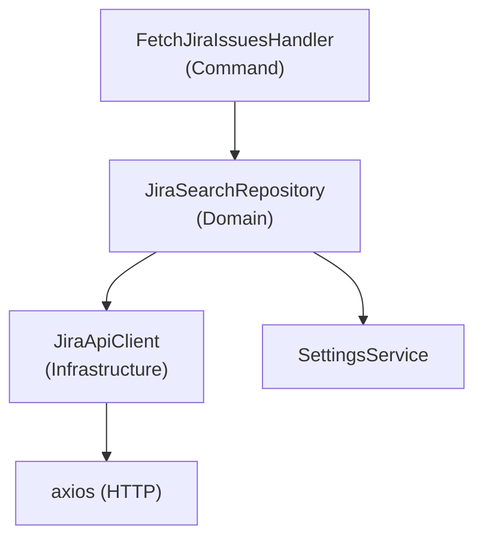

# Jira Module Dokumentation

Business-Logik für Jira-Integration: Repository, API Client, Commands und Data Mappings.

---

## Schichten



**Pattern:** Command Handler → Repository → API Client

Der Handler ist eine dünne Schicht. Die Business-Logik liegt im Repository. Der API Client kümmert sich nur um HTTP.

---

## Jira Search Repository

**Datei:** [extension/src/module/jira/src/domain/repository/jira-search.repository.ts](../../extension/src/module/jira/src/domain/repository/jira-search.repository.ts)

```typescript
@singleton()
export class JiraSearchRepository {
  constructor(
    private readonly api: JiraApiClient,
    private readonly settings: SettingsService,
  ) {}
}
```

**Responsibilities:**
- JQL Queries bauen
- Settings laden (Migrations)
- Jira DTO → Shared Domain Model mappen

### Methoden

#### getIssues()

Lade alle Issues außer Done.

```typescript
async getIssues(): Promise<JiraIssueListResponse> {
  // 1. Status- und ProjectKey aus Settings laden
  // 2. JQL Query bauen (alle außer Done)
  // 3. POST /search aufrufen
  // 4. DTO → JiraIssueListItem mappen
  // 5. JiraIssueListResponse zurückgeben
}
```

**JQL Beispiel:**
```
project = PROJECTKEY AND assignee = currentUser()
AND status != "Done" AND status != "Closed"
```

#### getFocusTask()

Lade aktuellste IN_PROGRESS Issue des currentUser.

```typescript
async getFocusTask(): Promise<JiraIssue | null> {
  // 1. IN_PROGRESS Status aus Settings laden
  // 2. JQL Query mit IN_PROGRESS Filter
  // 3. POST /search mit maxResults=1
  // 4. DTO → JiraIssue mappen (mit jiraUrl + description)
}
```

**JQL Beispiel:**
```
project = PROJECTKEY AND assignee = currentUser()
AND (status = "In Progress" OR status = "In Bearbeitung")
ORDER BY updated DESC
```

### Mappings

#### JiraIssueListItemDTO → JiraIssueListItem

```typescript
private mapToJiraIssueList(dto: JiraIssueListItemDTO): JiraIssueListItem {
  const issueType = this.mapIssueType(dto.fields.issuetype.name);
  const status = this.mapStatus(dto.fields.status.name);

  return {
    id: dto.id,
    key: dto.key,
    summary: dto.fields.summary,
    issueType: issueType || "FEATURE",
    priority: dto.fields.priority,
    status: status || "TO_DO",
    remainingTimeSeconds: dto.fields.timetracking?.remainingEstimateSeconds || 0,
    timeSpentSeconds: dto.fields.timetracking?.timeSpentSeconds || 0,
  };
}
```

Die Mappings nutzen `ISSUE_TYPE_MAPPING` und `STATUS_MAPPING` aus den VSCode-Settings.

#### JiraIssueDTO → JiraIssue

Erbt von `mapToJiraIssueList()` und erweitert um `jiraUrl` und `description`.

```typescript
private mapToJiraIssue(dto: JiraIssueDTO): JiraIssue {
  const base = this.mapToJiraIssueList(dto);
  const baseUrl = this.settings.get('JIRA_API_URL');

  return {
    ...base,
    jiraUrl: `${baseUrl}/browse/${dto.key}`,
    description: dto.renderedFields?.description ?? null
  };
}
```

---

## Jira API Client

**Datei:** [extension/src/module/jira/src/infrastructure/jira-api-client.ts](../../extension/src/module/jira/src/infrastructure/jira-api-client.ts)

```typescript
@singleton()
export class JiraApiClient {
  private readonly client: AxiosInstance;

  constructor(
    private readonly settings: SettingsService,
    private readonly notificationService: NotificationService,
  ) {
    this.client = this.createClient();
    this.registerResponseInterceptors();
  }
}
```

**Responsibilities:**
- Axios Instance konfigurieren (BaseURL, Auth)
- Response Interceptors für Error Handling
- `post(path, body)` - POST Requests an Jira REST API

### Client Konfiguration

```typescript
this.client = axios.create({
  baseURL: `${baseUrl}/rest/api/2`,
  headers: {
    Accept: "application/json",
    Authorization: `Bearer ${token}`,
    "Content-Type": "application/json",
  },
});
```

### Response Interceptor

```typescript
private registerResponseInterceptors() {
  this.client.interceptors.response.use(
    (response) => response,
    (error) => {
      // Error details zusammenbauen
      this.notificationService.showError(errorDetails);
      return Promise.reject(new Error(errorDetails));
    }
  );
}
```

**Error Messages:**

| Status | Message |
|---|---|
| 401 | "Jira-Token ungültig oder abgelaufen" |
| 403 | "Keine Berechtigung für diese Jira-Operation" |
| 404 | "Ressource in Jira nicht gefunden" |
| Sonst | "Jira-Anfrage fehlgeschlagen" |

### API Methoden

```typescript
async post<TResponse = unknown>(path: string, body: Record<string, unknown>): Promise<TResponse> {
  const response = await this.client.post(path, body);
  return response.data;
}
```

Nur `post()` ist implementiert. GET wird nicht gebraucht (Jira search API ist POST-only).

---

## Command Handler

### FetchJiraIssuesHandler

**Datei:** [extension/src/module/jira/src/commands/list.command.ts](../../extension/src/module/jira/src/commands/list.command.ts)

```typescript
@RegisterCommand("jira:get-issues")
export class FetchJiraIssuesHandler implements CommandHandler<JiraIssueListResponse> {
  async execute(): Promise<JiraIssueListResponse> {
    const repository = container.resolve(JiraSearchRepository);
    return await repository.getIssues();
  }
}
```

### FetchFocusTaskHandler

**Datei:** [extension/src/module/jira/src/commands/get-focus-task.ts](../../extension/src/module/jira/src/commands/get-focus-task.ts)

```typescript
@RegisterCommand("jira:get-focus-task")
export class FetchFocusTaskHandler implements CommandHandler<JiraIssue | null> {
  async execute(): Promise<JiraIssue | null> {
    const repository = container.resolve(JiraSearchRepository);
    return await repository.getFocusTask();
  }
}
```

### Handler Pattern

Handler sind dünne Schichten:

```
1. DI Container Resolution
   ↓
2. Repository Aufruf
   ↓
3. Result zurückgeben
```

**Nicht in Handler:**
- Error Handling (macht Repository/API)
- UI Logik
- Settings lesen (Repository liest Settings)

---

## Data Models

### Jira API DTOs

**Datei:** [extension/src/module/jira/src/infrastructure/model/jira-issue-dto.ts](../../extension/src/module/jira/src/infrastructure/model/jira-issue-dto.ts)

```typescript
interface JiraIssueListDTO<T = JiraIssueListItemDTO> {
  total: number;
  maxResults: number;
  startAt: number;
  issues: T[];
}

interface JiraIssueListItemDTO {
  id: string;
  key: string;
  fields: {
    summary: string;
    issuetype: { id: string; name: string; subtask: boolean };
    priority: { id: string; name: string };
    status: { id: string; name: string };
    timetracking: { ... };
  };
}
```

### Shared Domain Models

**Datei:** [shared/src/lib/jira/issue.ts](../../shared/src/lib/jira/issue.ts)

```typescript
interface JiraIssueListItem {
  id: string;
  key: string;
  summary: string;
  issueType: IssueType;      // "BUG" | "FEATURE"
  priority: { id: string; name: string };
  status: IssueStatus;       // "TO_DO" | "IN_PROGRESS" | "TEST" | "DONE"
  remainingTimeSeconds: number;
  timeSpentSeconds: number;
}

interface JiraIssue extends JiraIssueListItem {
  jiraUrl: string;
  description: string | null;
}
```

### Mappings

**Datei:** [shared/src/lib/jira/mappings.ts](../../shared/src/lib/jira/mappings.ts)

```typescript
type IssueType = "BUG" | "FEATURE";
type IssueTypeMapping = Record<string, IssueType>;
type IssueStatus = "TO_DO" | "IN_PROGRESS" | "TEST" | "DONE";
type StatusMapping = Record<string, IssueStatus>;
```
