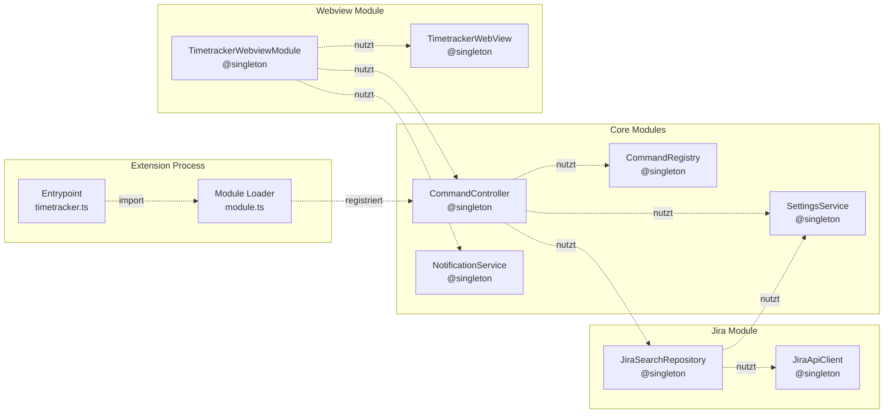

# Extension Overview

High-level Overview der VSCode-Extension. Architektur, Module und Einstieg für neue Entwickler.

---

## Was ist die Extension?

Die Extension ist der VSCode-Prozess. Sie startet, registriert Commands, erstellt das Webview-Panel und verarbeitet Command-Anfragen von der Webview.

**Entry Point:** `extension/src/timetracker.ts`

```
activate()
  │
  ├─ DI Container initialisieren (tsyringe)
  ├─ @module/jira importieren
  │   └─ @RegisterCommand Decorator registriert Handler
  │
  └─ Command "timetracker.openWebview" registrieren
      └─ TimetrackerWebviewModule.openDashboard()
```

---

## Module Struktur

```
extension/src/
├── timetracker.ts          # Entry Point
├── module.ts               # Module-Loader
├── core/
│   ├── command/            # Command-System
│   ├── exception/          # Exception Basisklassen
│   ├── notification/       # VSCode Notification Service
│   ├── settings/           # VSCode Settings Reader
│   └── constants/          # DI Tokens
└── module/
    ├── jira/               # Jira-Business-Logik
    └── webview/            # Webview Management
```

### Module Bootstrap

Module werden über den Import in `module.ts` geladen:

```typescript
// extension/src/module.ts
import '@module/jira';
```

Der `@RegisterCommand` Decorator registriert Handler beim Import. Ohne Import = keine Handler.

---

## Architektur



### DI Container

Der Container kommt von [tsyringe](https://microsoft.github.com/di-container-docs/).

```typescript
import { container, singleton } from "tsyringe";

// Singleton registrieren
@singleton()
class MyService { ... }

// Instance registrieren
container.registerInstance(EXTENSION_CONTEXT_TOKEN, context);

// Auflösung
container.resolve(MyService);
```

**Wichtig:** DI Container wird in `activate()` initialisiert. Before `activate()` ist der Container leer.

---

## Command Flow

```
Webview postMessage(CommandContainer)
  → onDidReceiveMessage(commandContainer)
    → commandController.exec(container)
      → Registry.get(command.type)
      → new handler(command).execute()
      → return CommandResponse | CommandErrorResponse
    → panel.webview.postMessage(result)
```

Jeder Command von der Webview wird über den CommandController geroutet. Siehe [EXTENSION_COMMANDS.md](EXTENSION_COMMANDS.md) für Details.

---

## Dokumentation

| Dokument | Inhalt |
|---|---|
| [extension-core.md](extension-core.md) | Core Module: Command-System, Settings, Exception, Notification |
| [extension-jira.md](extension-jira.md) | Jira Module: Repository, API Client, Commands |
| [extension-commands.md](extension-commands.md) | Command-System im Detail |
