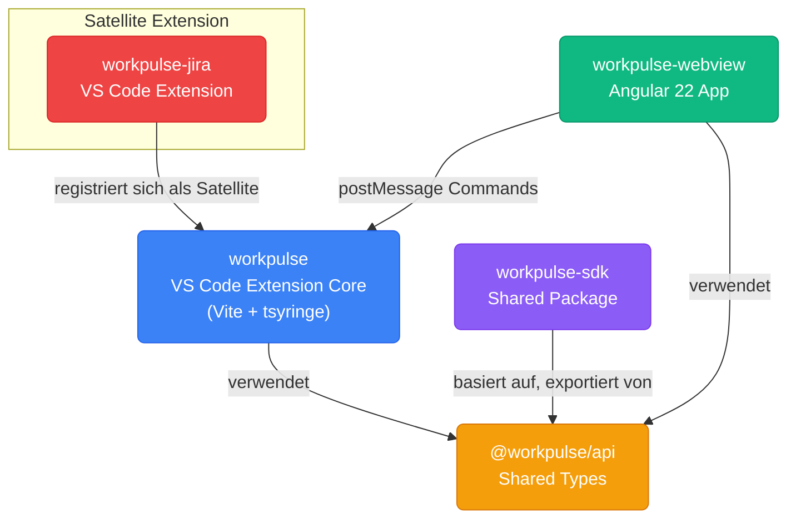

# Workpulse – Projektanalyse

## Was ist das?

Workpulse ist eine **VS Code Extension für Jira-Entwickler** (interner Einsatz bei attesto), die ein **Webview-Dashboard** öffnet, in dem man:

1. **Aktuelle Jira-Tasks** sieht – JQL-Query: alle offenen Tasks des aktuellen Users im konfigurierten Projekt
2. **Den Focus Task** identifiziert – der aktuell "in Progress" Task (sortiert nach "zuletzt aktualisiert")
3. **Zeit trackt** – Start/Stop des Timers direkt im Editor, ohne Browser-Wechsel
4. **Time Entry Details und Monthly Timesheets** einsehen kann

**Kernaussage:** Kein Browser-Wechsel mehr zwischen VS Code und Jira. Entwickler bleiben im Editor, tracken Zeit, sehen Task-Fortschritt – alles in einem VS Code Panel.

---

## Architektur – 4 Projekte



### Datenfluss

```
┌──────────────────────┐         postMessage          ┌─────────────────────────┐
│  workpulse-webview   │ ───────────────────────────► │   workpulse (Core)      │
│  Angular 22 + NGXS   │                              │   VS Code Extension     │
│                      │                              │                         │
│  • VsCodeBridge      │ ◄──────────────────────────  │   • CommandController   │
│  • Facades           │    CommandResponse            │   • CommandRegistry     │
│  • Feature States    │                              │   • Satellite Service   │
└──────────────────────┘                              └──────────┬────────────────┘
                                                                 │
                                                    registriert sich
                                                                 │
                          ┌──────────────────────────────────────┘
                          │
            ┌─────────────▼──────────────┐
            │  workpulse-jira (Satellite)│
            │  • Jira API Client         │
            │  • Jira Search Repository  │
            │  • Command Handler         │
            └────────────────────────────┘

┌────────────────────────────┐         nutzt         ┌─────────────────────────────┐
│  @workpulse/api            │ ◄──────────────────── │ workpulse-sdk               │
│  Shared Types              │                       │ @trueffelmafia/workpulse-sdk│
│                            │                       │                             │
│  • Command Types           │                       │  • CommandController        │
│  • Jira DTOs & Domain      │                       │  • CommandRegistry          │
│  • Timetracker Types       │                       │  • @RegisterCommand         │
│  • Logger Types            │                       │                             │
│  • Mappings                │                       └─────────────────────────────┘
└────────────────────────────┘                              ▲
         ▲                      ↑ nutzt                      │
         │                      │ nutzt                      │
         └──────────────────────┘────────────────────────────┘
```

### workpulse-sdk – Das Entwickler-Paket

Basiert auf `@workpulse/api`, exportiert die Command-Infrastruktur. Entwickler bauen ihre Extensions darauf auf.

| Export | Beschreibung |
|--------|-------------|
| `CommandController` | Singleton – Deduplizierung (SHA256 Hash), 30s Timeout, Handler-Execution |
| `CommandRegistry` | Handler-Map: Command-Typ → Handler-Klasse |
| `@RegisterCommand(type)` | Decorator für Auto-Registration bei Startup |
| `CommandHandler<T>` | Interface mit `execute(): Promise<T> | T` |

Dependencies: `reflect-metadata`, `tsyringe`

### @workpulse/api – Die Typen-Basis

Reine Type-Definitionen, **keine Laufzeit-Logik** – Single Source of Truth für Extension und Webview.

| Bereich | Inhalt |
|---------|--------|
| **Jira Domain** | `IssueListItem`, `FocusedIssue`, `JiraIssueDetails`, Mappings (`IssueType: "BUG"|"FEATURE"`, `IssueStatus: "TO_DO"|"IN_PROGRESS"|"TEST"|"DONE"`) |
| **Commands** | `Command<"jira:get-issues">`, `Command<"jira:get-focus-task">`, `Command<"jira:get-issue-detail">` |
| **Timetracker** | `TimeEntry`, `TimeEntryList`, `TimesData`, Start/Stop/Update/Delete Commands |
| **Logger** | `LogLevel`, `LogEntry`, `SendLogCommand` |

### workpulse (VS Code Extension Core) – Host Context, alle Privilegien

Vite-Bundle (`workpulse.js`, CJS) – extern: `vscode`, `fs`, `path`, `crypto`.

| Bereich | File | Beschreibung |
|---------|------|-------------|
| **Entry** | [src/workpulse.ts](../workpulse/src/workpulse.ts) | `activate()`, `deactivate()`, DI-Setup (tsyringe), Satellite-Service |
| **Bootstrap** | [src/module.ts](../workpulse/src/module.ts) | Importiert Logger und Timetracker (Side-Effect-Imports) |
| **Jira API** | [src/module/jira/src/infrastructure/jira-api-client.ts](../workpulse/src/module/jira/src/infrastructure/jira-api-client.ts) | Axios-Client mit Auth, Response-Interceptoren, User-Messages (401/403/404) |
| **Jira Repo** | [src/module/jira/src/domain/repository/jira-search.repository.ts](../workpulse/src/module/jira/src/domain/repository/jira-search.repository.ts) | JQL-Queries, Status/Type Mappings, Focus Task |
| **Timetracker** | [src/module/timetracker/src/services/time-tracker.service.ts](../workpulse/src/module/timetracker/src/services/time-tracker.service.ts) | Timer, Auto-Stop, Cross-Day Splitting, Timesheet |
| **Timesheet Storage** | [src/module/timetracker/src/services/timesheet.repository.ts](../workpulse/src/module/timetracker/src/services/timesheet.repository.ts) | Month-wise JSON-Dateien, Lazy-Load, Transaction Pattern |
| **Webview** | [src/module/webview/src/provider/workpulse-webview.ts](../workpulse/src/module/webview/src/provider/workpulse-webview.ts) | Panel-Erstellung, CSP, Path-Konvertierung |
| **Webview Module** | [src/module/webview/src/workpulse-webview-module.ts](../workpulse/src/module/webview/src/workpulse-webview-module.ts) | Command-Routing von Webview zu CommandController |
| **Core DI** | [src/core/satellite/src/satellite.service.ts](../workpulse/src/core/satellite/src/satellite.service.ts) | Plugin-System – Satelliten-Extensions registrieren sich hier |
| **Core Settings** | [src/core/settings/src/settings.service.ts](../workpulse/src/core/settings/src/settings.service.ts) | VS Code Config-Wrapper für Jira-Einstellungen |
| **Core Logger** | [src/core/logger/src/provider/logger.service.ts](../workpulse/src/core/logger/src/provider/logger.service.ts) | File-basierter Logger (`~/workpulse-logs/workpulse.log`) |
| **Core Notification** | [src/core/notification/src/notification.service.ts](../workpulse/src/core/notification/src/notification.service.ts) | VS Code Error/Warning/Info Messages |

Vite-Bundle (`workpulse.js`, CJS) – extern: `vscode`, `fs`, `path`, `crypto`.

| Bereich | File | Beschreibung |
|---------|------|-------------|
| **Entry** | [src/workpulse.ts](../workpulse/src/workpulse.ts) | `activate()`, `deactivate()`, DI-Setup, Satellite-Service |
| **Bootstrap** | [src/module.ts](../workpulse/src/module.ts) | Importiert Logger und Timetracker (Side-Effect-Imports) |
| **Jira API** | [src/module/jira/src/infrastructure/jira-api-client.ts](../workpulse/src/module/jira/src/infrastructure/jira-api-client.ts) | Axios-Client mit Auth, Response-Interceptoren, User-Messages (401/403/404) |
| **Jira Repo** | [src/module/jira/src/domain/repository/jira-search.repository.ts](../workpulse/src/module/jira/src/domain/repository/jira-search.repository.ts) | JQL-Queries, Status/Type Mappings |
| **Timetracker** | [src/module/timetracker/src/services/time-tracker.service.ts](../workpulse/src/module/timetracker/src/services/time-tracker.service.ts) | Timer, Auto-Stop, Cross-Day Splitting, Timesheet |
| **Timesheet Storage** | [src/module/timetracker/src/services/timesheet.repository.ts](../workpulse/src/module/timetracker/src/services/timesheet.repository.ts) | Month-wise JSON-Dateien, Lazy-Load, Transaction Pattern |
| **Webview** | [src/module/webview/src/provider/workpulse-webview.ts](../workpulse/src/module/webview/src/provider/workpulse-webview.ts) | Panel-Erstellung, CSP, Path-Konvertierung |
| **Webview Module** | [src/module/webview/src/workpulse-webview-module.ts](../workpulse/src/module/webview/src/workpulse-webview-module.ts) | Command-Routing von Webview zu CommandController |
| **Core DI** | [src/core/satellite/src/satellite.service.ts](../workpulse/src/core/satellite/src/satellite.service.ts) | Plugin-System für Submodule |
| **Core Settings** | [src/core/settings/src/settings.service.ts](../workpulse/src/core/settings/src/settings.service.ts) | VS Code Config-Wrapper für Jira-Einstellungen |
| **Core Logger** | [src/core/logger/src/provider/logger.service.ts](../workpulse/src/core/logger/src/provider/logger.service.ts) | File-basierter Logger (`~/workpulse-logs/workpulse.log`) |
| **Core Notification** | [src/core/notification/src/notification.service.ts](../workpulse/src/core/notification/src/notification.service.ts) | VS Code Error/Warning/Info Messages |

### Webview (`workpulse-webview`) – Angular 22, komplett isoliert

Standalone Components, RxJS, NGXS Store, Angular Material.

| Bereich | Beschreibung |
|---------|-------------|
| **App Config** | NGXS Stores (`SessionState`, `JiraState`, `TimetrackerState`), `PortalRouter`, Facade-Implementierungen |
| **VS Code Bridge** | `VsCodeBridgeService` – postMessage/`window.message` mit UUID-Matching und RxJS Observables |
| **Facades** | `JiraVsCode`, `TimeTrackerVsCode`, `LoggerVsCode` – einzige Kontaktpunkte zur Extension |
| **Features/Jira** | Issue-Liste, Issue-Detail, Focus-Task-Widget, Issue-Selector |
| **Features/Timetracker** | Month-Bookings Widget, NGXS State |
| **Common** | Timer-Buttons, Session-Widget, Widget-Base, Safe-HTML Pipe |
| **Theme** | SCSS mit Variables, Mixins, Functions, Component Overrides, Material Customizations |

---

## Das Command-Mediatron – das Herzstück

Das Command-Mediatron ist das architektonische Kernstück. Die gesamte Kommunikation zwischen Webview und Extension läuft darüber:

```
Webview                      Extension
───────                      ─────────
Component                    WorkpulseWebviewModule
   │                             │
   │  CommandContainer {         │
   │    id: uuid,                │
   │    command: {               │
   │      type: "jira:get-issues",
   │      payload: {}            │
   │    }                        │
   │  } ── postMessage ──────►   │  CommandController.exec()
   │                             │     ├─ Dedup (SHA256 Hash-Map)
   │                             │     ├─ Timeout (30s)
   │                             │     ├─ Registry Lookup
   │                             │     │    @RegisterCommand()
   │                             │     │    └─ Handler instantiate
   │                             │     └─ Execute
   │  CommandResponse {           │
   │    id: uuid,                │◄───│     Result
   │    code: 0,                 │
   │    data: { ... }            │
   │  } ── postMessage ───────►  │
```

### Warum dieser Umweg? Drei Gründe:

1. **Isolation** – Der Webview läuft im Browser-Context und hat **keinen Zugriff** auf VS Code API, `fs`, `crypto`. Er darf nur `postMessage` schicken. Die Extension ist der einzige Ort, wo echte Operationen passieren können.

2. **Typsicherheit** – Durch das geteilte `@workpulse/api` wissen Extension und Webview exakt, welche Commands es gibt und welche Payloads sie erwarten. Kein loose JSON-RPC.

3. **Resilienz** – Deduplication (gleicher Payload = dasselbe Promise) und 30s Timeout verhindern doppelte Calls und hängende Requests.

### Command Registry & Decorator

```typescript
// Handler registrieren sich via Decorator zur Startup-Zeit
@RegisterCommand("jira:get-issues")
export class FetchJiraIssuesHandler implements CommandHandler<IssueList> {
  async execute(): Promise<IssueList> {
    const repo = container.resolve(JiraSearchRepository);
    return repo.getIssues();
  }
}

// CommandController löst den Handler auf, führt aus, gibt Antwort zurück
```

### Command Handler im Projekt

| Command | Handler | File |
|---------|---------|------|
| `jira:get-issues` | `FetchJiraIssuesHandler` | [module/jira/.../list.command.ts](../workpulse/src/module/jira/src/commands/list.command.ts) |
| `jira:get-focus-task` | `FetchFocusTaskHandler` | [module/jira/.../get-focus-task.ts](../workpulse/src/module/jira/src/commands/get-focus-task.ts) |
| `jira:get-issue-detail` | `GetIssueDetailHandler` | [module/jira/.../get-issue-detail.command.ts](../workpulse/src/module/jira/src/commands/get-issue-detail.command.ts) |
| `timetracker:start-tracking` | `StartTrackingHandler` | [module/timetracker/.../start-tracking.command.ts](../workpulse/src/module/timetracker/src/commands/start-tracking.command.ts) |
| `timetracker:stop-tracking` | `StopTrackingHandler` | [module/timetracker/.../stop-tracking.command.ts](../workpulse/src/module/timetracker/src/commands/stop-tracking.command.ts) |
| `timetracker:get-active-timer` | `GetActiveTimerHandler` | [module/timetracker/.../get-active-timer.command.ts](../workpulse/src/module/timetracker/src/commands/get-active-timer.command.ts) |
| `timetracker:get-month` | `GetMonthHandler` | [module/timetracker/.../get-month.command.ts](../workpulse/src/module/timetracker/src/commands/get-month.command.ts) |

---

## Timetracker – Die cleverste Komponente

### Auto-Stop Pattern

Beim `startTracking()` wird ein laufender Timer automatisch gestoppt – man kann nicht versehentlich zwei Timers parallel laufen lassen.

### Cross-Day Splitting

Wenn ein Timer über Mitternacht läuft (typisch für Home Office), wird der Entry **tagesweise** gesplittet:

```
Entry start: 2025-01-15T22:00:00
Entry end:   2025-01-16T02:00:00

Wird zu:
  Entry 1: 2025-01-15T22:00:00 → 2025-01-15T23:59:59.999Z
  Entry 2: 2025-01-16T00:00:00 → 2025-01-16T02:00:00
```

### Storage Strategy

- Pro Monat eine `YYYY-MM.json` Datei im VS Code globalStorageDirectory
- Lazy-Load (alle Dateien初次 laden), dann in-memory cache
- Write-Batch durch `save()` – Transaction Pattern: `add()`/`stopTracking()` sammeln Änderungen, `save()` flush

---

## Warum existiert das?

1. **Produktivitäts-Tool** – Entwickler wechseln nie zwischen Browser und Editor
2. **Interne Lösung** – nicht als Marketplace-Package, sondern als firmeninternes Tool (Name "attesto", Autor "Ralf Hannuschka")
3. **Extensible Plattform** – das Satellite-System (`SatelliteService`) ist designed, um später weitere Module hinzuzufügen (Confluence? GitHub? CI-Pipelines?)
4. **Command-Architektur** ist generisch genug, dass sie prinzipiell auch über VS Code hinausgehen könnte

---

## Warum so komplex?

| Komplexitätsgrad | Grund |
|-----------------|-------|
| Command-Pattern mit Dedup/Timeout | Webview-Isolation erzwingt RPC – aber mit Typsicherheit und Resilienz |
| tsyringe DI | Konsistente Dependency Injection, testbare Services, Singleton-Semantik |
| 3-Paket-Struktur (api + ext + wv) | Shared Types zwischen Browser und Host – kein Duplizieren von Interfaces |
| Month-File Storage | Skalierbarkeit – bei 100+ Zeiteinträgen pro Monat keine riesige JSON |
| Satellite-Service | Plugin-Architektur für zukünftige Module |
| Cross-Day Timer Split | Realistische Verwendungsszenarien (Home Office, lange Sessions) |
| Feature-Sliced FE | Wartbarkeit bei wachsender Komplexität |

Die Architektur ist bewusst auf **Extensibilität** und **Trennung** getrimmt. Sie ist "übergemessen" für ein simples Timer-Tool – aber das Team baut ein **erweiterbares Framework**, nicht nur ein simples Timer-Tool.

---

## Build & Entwicklung

```bash
npm install
npm run build:sdk    # workpulse-sdk bauen
npm run build:api    # @workpulse/api bauen
npm run build:webview # Angular Webview (→ ../extension/dist/)
npm run build:ext    # Extension Bundle (Vite)
```

Im Workspace: `npm run build` orchestriert die gesamte Pipeline.

### Webview Dev-Server

```bash
cd workpulse-webview && npm start
# Angular HMR-Server auf localhost:4200
```

### Extension Dev-Debug

```bash
code .                    # Workspace öffnen
F5                        # Debug-Session startet Extension
```

---

## Zweite Extension: `workpulse-jira`

Neben der Haupt-Extension (`workpulse`) gibt es eine zweite (`workpulse-jira`), die als eigenständige VS Code Extension auf `workpulse` aufbaut. Dasselbe Vite-Config-Muster (Entry: `src/workpulse-jira.ts`, CJS-Ausgabe `dist/workpulse-jira.js`).

---

## SDK: `@trueffelmafia/workpulse-sdk`

Exportiert den `command` Subpath mit:
- `CommandController` – Singleton, Dedup, Timeout, Handler-Execution
- `CommandRegistry` – Handler-Map nach Command-Typ
- `@RegisterCommand` Decorator – Auto-Registration bei Startup
- `CommandHandler<T>` Interface mit `execute()` Methode

Dependencies: `reflect-metadata`, `tsyringe`

---

## Git-Branch: `feat/issue-list-scss`

Derzeitige Feature-Branch. Letzter Commit: Issue List SCSS, Issue Details, Logging Infrastructure, Angular Material Theme, Session Management.

---

## Bekannte Probleme (aus Code)

- `ERROR_CODE` Enum enthält nur `TIMEOUT` – 10000/12000 sollten ergänzt werden
- `BaseException` constructor Parameter `e` wird als `error` getter gelesen, aber nicht weiterverarbeitet
- `@workpulse/api` workspace name in root `package.json` ist `workpulse-api`, lebt aber im Verzeichnis `api/` (Naming Mismatch)
