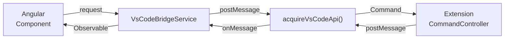
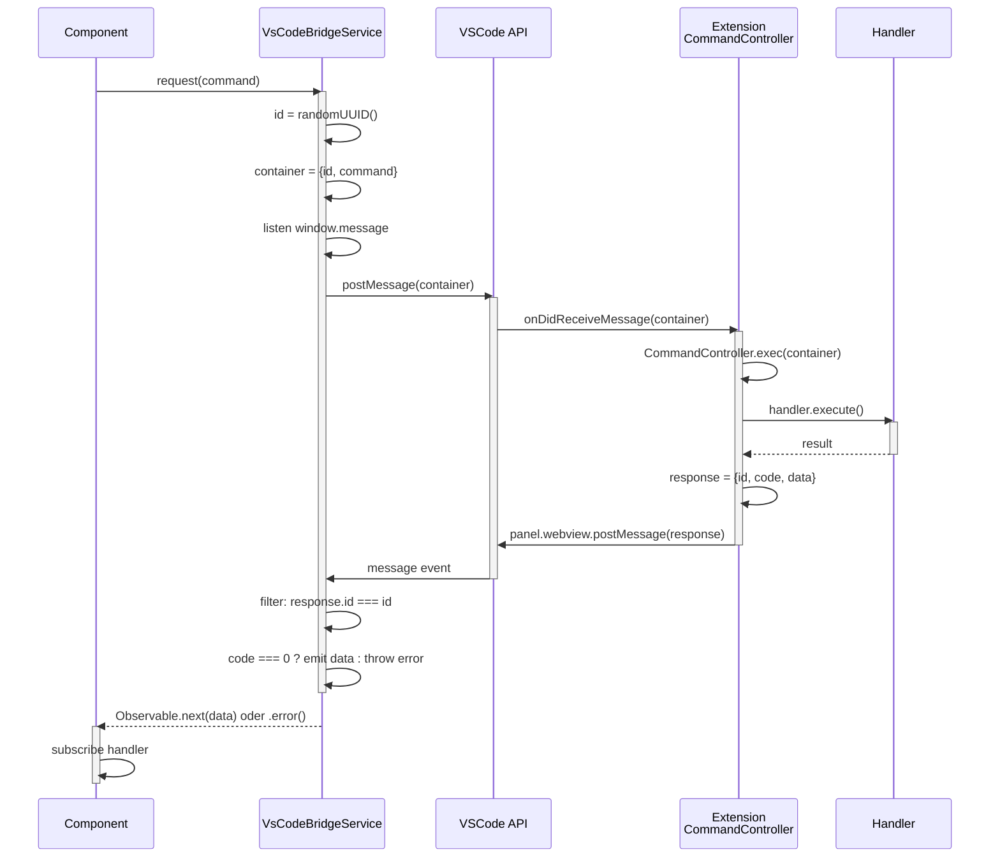

# Webview Kommunikation

Wie die Angular Webview Commands zur Extension sendet und Responses empfängt.

---

## Inhaltsverzeichnis

1. [Überblick](#überblick)
2. [VsCodeBridgeService](#vscodebridgeservice)
3. [Commands von Components senden](#commands-von-components-senden)
4. [Praktische Beispiele](#praktische-beispiele)
5. [Error Handling](#error-handling)
6. [Best Practices](#best-practices)

---

## Überblick

Die Webview läuft in einem isolierten Kontext und kann nur über die VSCode API mit der Extension kommunizieren:



**Flow:**
1. Component sendet Command über `VsCodeBridgeService.request()`
2. Service packt in `CommandContainer` und sendet via `acquireVsCodeApi().postMessage()`
3. Extension erhält Command und verarbeitet es
4. Extension sendet `CommandResponse` zurück via `panel.webview.postMessage()`
5. Service horcht auf `window.message` Events und matched Response-ID
6. Component erhält Result als Observable

---

## VsCodeBridgeService

Der Service ist die zentrale Kommunikationsschnittstelle zwischen Webview und Extension.

### API

```typescript
import { VsCodeBridgeService } from '@feature/core';

export class VsCodeBridgeService {
  /**
   * Sendet einen Command zur Extension und wartet auf Response
   * @param command - Der zu sendende Command
   * @returns Observable mit dem Result
   */
  request<T>(command: Command): Observable<T | undefined>
}
```

### Interne Funktionsweise

```typescript
request<T>(command: Command): Observable<T | undefined> {
  // 1. CommandContainer mit eindeutiger ID erstellen
  const container: CommandContainer<Command> = {
    id: crypto.randomUUID(),
    command,
  };

  // 2. Command zur Extension senden
  acquireVsCodeApi().postMessage(container);

  // 3. Auf Response horchen (mit Response-ID matching)
  return this.messageEvent$.pipe(
    first(),                                          // Nur erste Response
    filter(({ data: response }) => 
      response.id === container.id                   // Response-ID matching
    ),
    map(({ data: response }) => {
      if (this.isErrorResponse(response)) {
        throw new Error(response.error.message);      // Fehler werfen
      }
      return (response as CommandResponse<T>).data;  // Data extrahieren
    }),
  );
}
```

**Wichtig:**
- Jeder Command bekommt eine eindeutige `container.id` (UUID)
- Extension sendet die gleiche `id` in der Response zurück
- Service matched die IDs und liefert das Ergebnis dem richtigen Aufrufer
- `first()` = nur die erste Response wird genommen
- Errors werden als `Error` in das Observable geworfen

---

## Commands von Components senden

### Schritt 1: Service injizieren

```typescript
import { Component, inject } from '@angular/core';
import { VsCodeBridgeService } from '@feature/core';

@Component({
  selector: 'my-component',
  template: `...`
})
export class MyComponent {
  private vscodeBridge = inject(VsCodeBridgeService);
  
  // ...
}
```

### Schritt 2: Command senden und Result verarbeiten

```typescript
async loadData() {
  const command: GetIssuesCommand = {
    type: 'jira:get-issues'
  };

  this.vscodeBridge.request<JiraIssueListResponse>(command)
    .subscribe({
      next: (data) => {
        console.log('Issues geladen:', data);
        this.issues = data.data;
      },
      error: (error) => {
        console.error('Fehler beim Laden:', error.message);
        this.showError(error);
      }
    });
}
```

### Schritt 3: Mit RxJS Interop arbeiten (Angular 22+)

```typescript
import { rxResource } from '@angular/core/rxjs-interop';

@Component({...})
export class IssuesComponent {
  private vscodeBridge = inject(VsCodeBridgeService);

  // Automatisches Laden mit rxResource
  protected readonly issues$ = rxResource({
    stream: () => {
      const command: GetIssuesCommand = {
        type: 'jira:get-issues'
      };
      return this.vscodeBridge.request<JiraIssueListResponse>(command);
    },
  });

  // Im Template: {{ issues$.value() }} oder issues$.isLoading()
}
```

---

## Praktische Beispiele

### Beispiel 1: Einfacher Command ohne Payload

```typescript
// Component
async refreshData() {
  this.vscodeBridge.request({ type: 'jira:get-issues' })
    .subscribe(
      data => this.handleData(data),
      error => this.handleError(error)
    );
}
```

### Beispiel 2: Command mit Payload

```typescript
// Annahme: Es gibt einen Command mit Payload
const command: CreateTimeEntryCommand = {
  type: 'jira:create-time-entry',
  payload: {
    issueKey: 'ABC-123',
    timeSpent: 3600
  }
};

this.vscodeBridge.request<TimeEntry>(command)
  .subscribe(
    result => console.log('Time Entry erstellt:', result),
    error => console.error('Fehler:', error)
  );
```

### Beispiel 3: In einem Service gekapselt

```typescript
// services/jira.service.ts
import { Injectable, inject } from '@angular/core';
import { VsCodeBridgeService } from '@feature/core';
import type { GetIssuesCommand, JiraIssueListResponse } from '@timetracker/api';

@Injectable({ providedIn: 'root' })
export class JiraService {
  private vscodeBridge = inject(VsCodeBridgeService);

  getIssues() {
    const command: GetIssuesCommand = {
      type: 'jira:get-issues'
    };
    return this.vscodeBridge.request<JiraIssueListResponse>(command);
  }

  createTimeEntry(issueKey: string, seconds: number) {
    const command: CreateTimeEntryCommand = {
      type: 'jira:create-time-entry',
      payload: { issueKey, timeSpent: seconds }
    };
    return this.vscodeBridge.request<TimeEntry>(command);
  }
}

// component/issues.component.ts
@Component({...})
export class IssuesComponent {
  private jiraService = inject(JiraService);

  ngOnInit() {
    this.jiraService.getIssues()
      .subscribe(data => this.issues = data.data);
  }

  onLogTime(issueKey: string, hours: number) {
    this.jiraService.createTimeEntry(issueKey, hours * 3600)
      .subscribe(
        () => this.showSuccess('Zeit geloggt'),
        error => this.showError(error)
      );
  }
}
```

---

## Error Handling

### Response Fehler

Wenn die Extension einen Fehler zurücksendet (code > 0), wirft der Service einen Error:

```typescript
this.vscodeBridge.request(command)
  .subscribe({
    next: (data) => {
      // code === 0, data ist verfügbar
      console.log('Success:', data);
    },
    error: (error: Error) => {
      // code > 0, error.message aus Extension
      console.error('Command failed:', error.message);
    }
  });
```

### Timeout Handling

Commands mit Timeout (>30s) erhalten eine `TimeoutException` von der Extension:

```typescript
this.vscodeBridge.request(command)
  .pipe(
    timeout(35000), // Extra Sicherheit
    catchError(error => {
      console.error('Timeout oder Fehler:', error);
      return of(null);
    })
  )
  .subscribe(data => {
    if (!data) {
      this.showError('Request timed out');
      return;
    }
    this.handleData(data);
  });
```

---

## Best Practices

### ✅ DO

- **Services verwenden:** Kapsle Bridge-Aufrufe in Services (wie `JiraService`)
- **Typensicherheit:** Nutze die Command Types aus `@timetracker/api`
- **RxJS Operators:** `switchMap`, `combineLatest`, etc. für komplexe Flows
- **Loading States:** Nutze `resource.isLoading()` für UI Feedback
- **Error Messages:** Zeige aussagekräftige Fehlermeldungen
- **Unsubscribe:** Bei Subscriptions außerhalb von Templates immer unsubscribe oder `async` Pipe nutzen

### ❌ DON'T

- **Direkt acquireVsCodeApi() in Components:** Nutze immer `VsCodeBridgeService`
- **Commands hardcoden:** Nutze Types aus `@timetracker/api`
- **Ohne Error Handler:** Immer `error` Handler implementieren
- **Blockierende Operations:** Long-Running Commands sollten gebrochen werden
- **Alte .subscribe() statt async Pipe:** Im Template `resource.value() | async` oder `stream$ | async` verwenden

---

## Ablauf im Detail

### Kompletter Flow



---

## Zusammenfassung

| Komponente | Verantwortung |
|---|---|
| **Component** | Command senden, Result nutzen |
| **Service** | Commands kapseln, UI-Logik |
| **VsCodeBridgeService** | Message Routing, ID-Matching, Error Handling |
| **acquireVsCodeApi()** | Direkter Zugang zur VSCode API |
| **Extension** | Command-Execution, Response senden |
