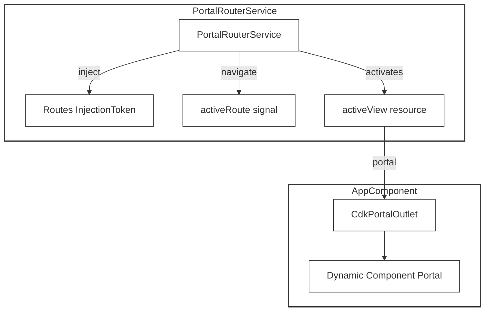
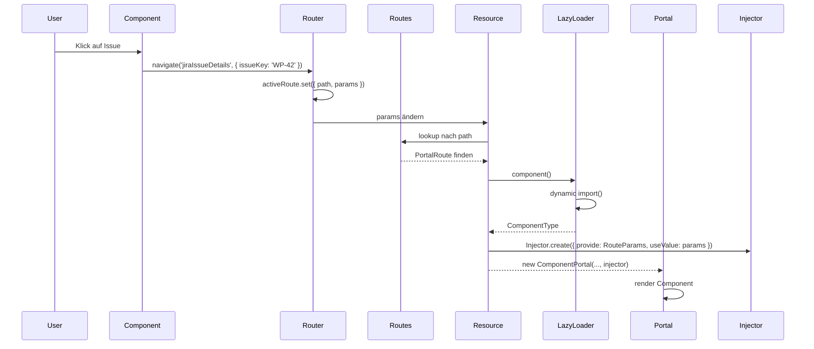

# Portal Router

Ein leichtgewichtiges, signal-basiertes Routing-System für VSCode Webviews mit Angular CDK Portal Outlet.

## Warum nicht Angular Router?

VSCode Webviews laufen in einem iframe ohne Browser History API. Der offizielle Angular Router (`RouterModule`) setzt `pushState`, `popState` und Browser-Navigation voraus — was im Webview-Kontext nicht verfügbar ist.

Dieses Routing-System ersetzt den Angular Router mit einem minimalen, aber leistungsfähigen Ansatz.

## Architektur



## Funktionsweise

1. **Konfiguration** — Routes werden als Array von `PortalRoute`-Objekten registriert
2. **Navigation** — `navigate(path, params?)` setzt ein Signal, das die aktivierte Route enthält
3. **Parameter-Übergabe** — Optionale params werden über ein `RouteParams` InjectionToken an die Zielkomponente weitergegeben
4. **Lazy Loading** — `Angular resource()` lädt die Komponente asynchron nur bei Bedarf
5. **Reaktivität** — Änderungen am Route-Signal lösen automatisch einen Neuladen aus
6. **Default Route** — Wenn keine Route matcht, wird die Route mit `default: true` verwendet

## Datenfluss



## API

### Interface

```typescript
interface PortalRoute {
    path: string;
    default?: boolean;
    component: () => Promise<ComponentType<unknown>>
}

type RouteParams = Record<string, unknown>;
```

### providePortalRouter()

Provider-Funktion zur Registrierung der Routes:

```typescript
providePortalRouter(config: PortalRoute[]): EnvironmentProviders
```

### PortalRouterService

```typescript
@Service()
class PortalRouterService {
  activeRoute: signal<{ path: string; params?: RouteParams } | null>
  activeView: resource<ComponentPortal>
  navigate<TParams extends RouteParams>(path: string, params?: TParams): void
}
```

### Parameter-Übergabe

Parameter werden über ein `InjectionToken<RouteParams>` an die Zielkomponente weitergegeben:

```typescript
// Router – Übergabe
this.router.navigate('jiraIssueDetails', { issueKey: 'WP-42' });

// Zielkomponente – Empfang
const params = inject(RouteParams);
const issueKey = params?.issueKey as string;
```

## Nutzung

### 1. Routes definieren

```typescript
// src/app/router.config.ts
export const routerConfig: PortalRoute[] = [
  {
    path: 'dashboard',
    component: () => import('./components/dashboard.component')
      .then(m => m.DashboardComponent),
  },
  {
    path: 'jiraIssuesList',
    component: () => import('@workpulse/jira/feature-shell')
      .then(m => m.JiraIssuesListComponent),
  },
  {
    path: 'jiraIssueDetails',
    component: () => import('@workpulse/jira/feature-shell')
      .then(m => m.IssueDetailsComponent),
  },
  {
    path: 'default',
    default: true,
    component: () => import('./components/dashboard.component')
      .then(m => m.DashboardComponent),
  },
];
```

### 2. Provider registrieren

```typescript
// src/app/app.config.ts
import { providePortalRouter } from '@workpulse/core/portal-router';

export const appConfig: ApplicationConfig = {
  providers: [
    providePortalRouter(routerConfig),
    // ... andere Provider
  ],
};
```

### 3. PortalOutlet im Template

```html
<!-- app.component.html -->
<cdk-portal-outlet [portal]="portalRouterService.activeView"></cdk-portal-outlet>
```

### 4. Navigation ausführen

```typescript
// Aus beliebiger Komponente
constructor(private router: PortalRouterService) {}

navigateToDetails(issueKey: string): void {
  this.router.navigate('jiraIssueDetails', { issueKey });
}
```

## Vorteile gegenüber Angular Router

| Feature | Angular Router | Portal Router |
|---------|---------------|---------------|
| VSCode Webview | ❌ Nicht kompatibel | ✅ Native Unterstützung |
| Bundle Größe | +80KB | ~2KB |
| Setup | Bootstrap + Config | `providePortalRouter()` |
| Lazy Loading | RouterModule | `resource()` + dynamic import |
| Signal-Integration | ❌ | ✅ Native Signal-basiert |
| Dependency Injection | ❌ | ✅ InjectionToken |
