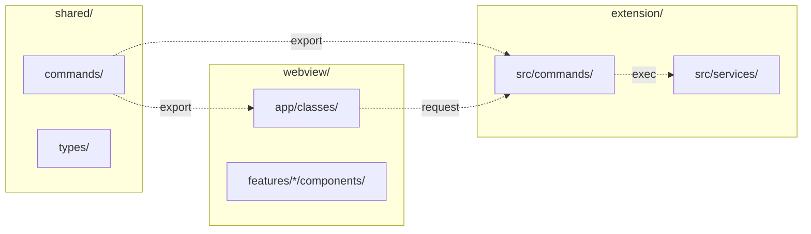
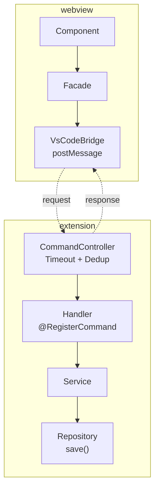

# Navigation Guide — TimeTracker VSCode Extension

Drei Projekte, drei Verzeichnisse, eine Extension.

---

## Command-Flow (Webview ↔ Extension)

---

## Wichtige Pfade

| Was | Extension | Webview |
|-----|-----------|---------|
| Handler-Verzeichnis | `extension/src/module/timetracker/src/commands/` | — |
| Service-Verzeichnis | `extension/src/module/timetracker/src/services/` | — |
| Facade-Verzeichnis | — | `webview/src/app/classes/` |
| Component-Verzeichnis | — | `webview/src/features/*/components/` |
| Shared Types | `shared/src/lib/timetracker/` | `shared/src/lib/timetracker/` |
| Module Export | `extension/src/module/timetracker/index.ts` | `webview/src/features/*/index.ts` |

---

## Import-Pfade

| Extension | Webview |
|-----------|---------|
| `@timetracker/api` | `@timetracker/api` (gleicher Pfad!) |
| `@core/command` | — |
| `@module/webview` | — |
| — | `@jira-flow/*` (Alias für `src/features/*/`) |
| — | `@features/*/` (relativ, kein Alias) |

---

## Neue Datei erstellen — Checkliste

### Shared Type
1. `shared/src/lib/timetracker/commands/<name>.command.ts` schreiben
2. In `shared/src/lib/timetracker/index.ts` exportieren

### Extension Handler
3. `extension/src/module/timetracker/src/commands/<name>.handler.ts` schreiben
4. `@RegisterCommand("timetracker:<name>")` Decorator
5. In `extension/src/module/timetracker/index.ts` exportieren

### Webview Facade
6. Interface in `webview/src/features/core/interfaces/time-tracker-flow-facade.ts` ergänzen
7. Facade-Methode in `webview/src/app/classes/time-tracker-vscode.ts` ergänzen

### Webview Component
8. Component in `webview/src/features/timetracker/components/` erstellen
9. In `webview/src/features/timetracker/index.ts` exportieren
10. In Dashboard importieren
