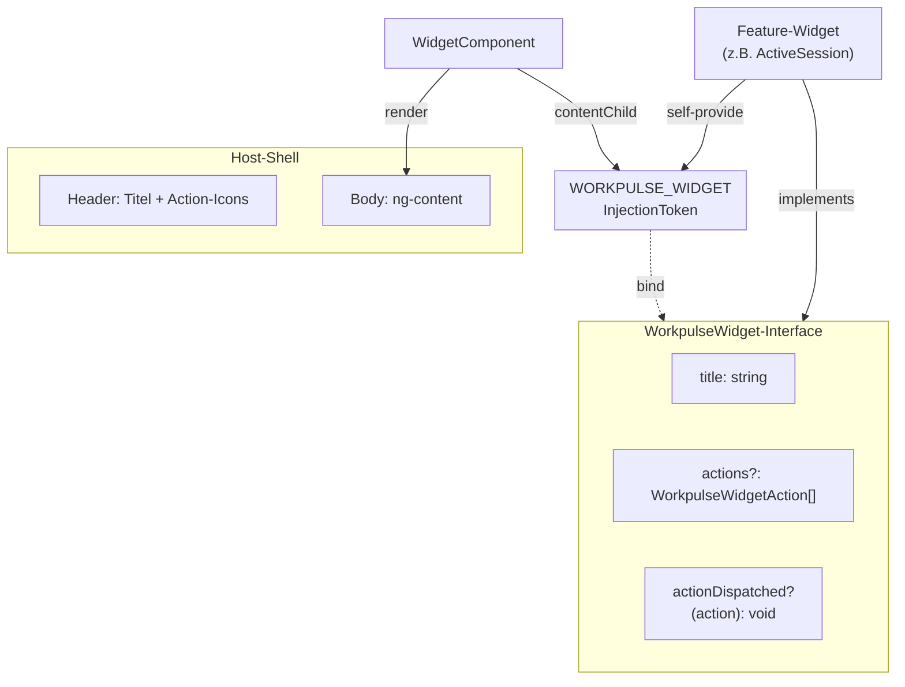

# Widget-System

Das Widget-System bietet ein wiederverwendbares Layout-Chrome (Header, Optionale
Action-Icons) für Feature-Widgets. Das Feature-Widget liefert Content, der
Widget-Host liefert das统一的 Layout.

---

## Architektur



**Prinzip:** Der Host kennt kein konkretes Feature-Widget. Er liest über den
`WORKPULSE_WIDGET`-Token die Metadaten (Titel, Actions) und rendert generisches
Layout. Der Content landet über `<ng-content>` im Body.

---

## Kontrakt: WorkpulseWidget

Jedes Widget-Feature muss diese Schnittstelle implementieren:

```typescript
export interface WorkpulseWidget {
  readonly title: string;
  readonly actions?: WorkpulseWidgetAction[];
  actionDispatched?(action: WorkpulseWidgetAction): void;
}
```

- **`title`** — statische Zeichenkette, angezeigt im Header
- **`actions`** — optionale Toolbar-Aktionen, gerendert als Icon-Buttons
- **`actionDispatched`** — optionaler Callback bei Icon-Button-Klick

Eine Action ist typisiert über:

```typescript
export interface WorkpulseWidgetAction<TAction = string> {
  readonly key: string;
  readonly icon: string;
  readonly action: TAction;
}
```

---

## WidgetComponent (Host-Shell)

```typescript
@Component({
  selector: 'workpulse-widget',
  templateUrl: './widget.component.html',
  encapsulation: ViewEncapsulation.None,
  imports: [MatIconButton, MatIcon],
  host: { class: 'workpulse-widget' },
})
export class WidgetComponent {
  private readonly widget = contentChild(WORKPULSE_WIDGET);

  protected readonly title = computed(() => {
    const w = this.widget();
    return w?.title ?? 'Loading ...';
  });

  protected readonly actions = computed(() => {
    const { actions } = this.widget() ?? {};
    return Array.isArray(actions) && actions.length > 0 ? actions : [];
  });

  protected dispatchAction(action: WorkpulseWidgetAction<string>) {
    const w = this.widget();
    if (w && w.actionDispatched) {
      w.actionDispatched(action);
    }
  }
}
```

Der Host tut drei Dinge:

1. **Widget lesen** — `contentChild(WORKPULSE_WIDGET)` holt das eingebettete
   Feature-Widget
2. **Metadaten extrahieren** — `title` und `actions` als Signal-Properties
3. **Actions delegieren** — Klicks auf Icon-Buttons gehen zurück an das
   Feature-Widget via `actionDispatched`

---

## Self-Provide Pattern

```typescript
@Component({
  selector: 'jiraflow-active-session',
  encapsulation: ViewEncapsulation.None,
  providers: [
    { provide: WORKPULSE_WIDGET, useExisting: ActiveSessionComponent },
  ],
})
export class ActiveSessionComponent implements WorkpulseWidget {
  readonly title = 'Aktive Session';

  readonly actions: WorkpulseWidgetAction[] = [
    { key: 'stop', icon: 'stop_circle', action: 'stop-session' },
  ];

  actionDispatched(action: WorkpulseWidgetAction): void {
    if (action.action === 'stop-session') {
      this.stopSession();
    }
  }
}
```

**Warum self-provide?** `contentChild(WORKPULSE_WIDGET)` sucht nach einem
Provider mit diesem Token im Child-Baum. Das Widget stellt sich selbst als
Implementierung seiner eigenen Schnittstelle bereit — Typsicherheit ohne
zusätzliche Abhängigkeit des Hosts auf das Feature-Widget.

---

## Widget erstellen

Ein Widget besteht aus zwei Schritten:

### Schritt 1: Component mit Interface + Provider

```typescript
@Component({
  selector: 'jiraflow-issue-selector',
  templateUrl: './issue-selector.component.html',
  encapsulation: ViewEncapsulation.None,
  providers: [
    { provide: WORKPULSE_WIDGET, useExisting: IssueSelectorComponent },
  ],
})
export class IssueSelectorComponent implements WorkpulseWidget {
  readonly title = 'Issue suchen';
}
```

Fertig. Die zwei verpflichtenden Zutaten sind:
1. `implements WorkpulseWidget` mit mindestens `title`
2. `providers` mit dem Self-Provide-Eintrag

### Schritt 2: Exportieren

```typescript
// im Feature-Module oder barrel export
export * from './issue-selector.component';
```

Mehr gibt's nicht. Kein Registry-Eintrag, keine Konfigurationsdatei, kein
Factory-Pattern.
