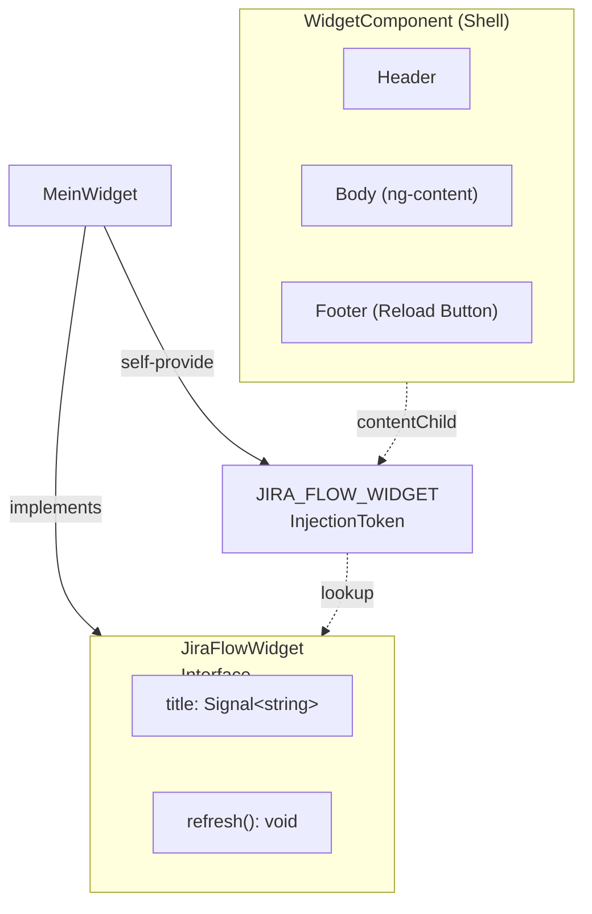

# Widget System

Das Widget-System bietet ein wiederverwendbares Layout für alle Widgets im Webview.

---

## Architektur



---

## Kontrakt: JiraFlowWidget

Jedes Widget, das in einem `WidgetComponent` gerendert wird, muss `JiraFlowWidget` implementieren:

```typescript
import type { Signal } from "@angular/core";

export interface JiraFlowWidget {
  readonly title: Signal<string>;
  refresh(): void;
}
```

**Contract:**

- **`title`** — Signal mit dem Anzeigetitel im Widget-Header
- **`refresh()`** — Wird vom Reload-Button im Footer aufgerufen

---

## WidgetComponent (Shell)

```typescript
@Component({
  selector: 'jiraflow-widget',
  template: `
    <div class="jf-widget-header">{{ title() }}</div>
    <div class="jf-widget-body">
      <ng-content></ng-content>
    </div>
    <div class="jf-widget-footer">
      <button class="jf-btn" role="button">Reload</button>
    </div>
  `,
})
export class WidgetComponent {
  private readonly widget = contentChild(JIRA_FLOW_WIDGET);

  protected readonly title = computed(() => {
    const loadedWidget = this.widget();
    return loadedWidget?.title() ?? 'Loading ...';
  });
}
```

**Verwendung:**

```html
<jiraflow-widget>
  <jiraflow-current-focus-task></jiraflow-current-focus-task>
</jiraflow-widget>
```

---

## Token: JIRA_FLOW_WIDGET

```typescript
import { InjectionToken } from '@angular/core';
import type { JiraFlowWidget } from '../interfaces/jira-flow-widget';

export const JIRA_FLOW_WIDGET = new InjectionToken<JiraFlowWidget>(
  'Widget welches angezeigt wird'
);
```

---

## Neues Widget erstellen

### Schritt 1: Interface + self-provide

Das Widget implementiert das Interface und registriert sich selbst als Provider:

```typescript
import type { JiraFlowWidget } from '@jira-flow/widget';
import { Component, signal } from '@angular/core';

@Component({
  selector: 'timetracker-timer-widget',
  templateUrl: './timer-widget.component.html',
  styleUrl: './timer-widget.component.css',
  providers: [
    {
      provide: JIRA_FLOW_WIDGET,
      useExisting: TimerWidgetComponent,
    },
  ],
})
export class TimerWidgetComponent implements JiraFlowWidget {
  readonly title = signal('Time Tracker');

  refresh(): void {
    // ...
  }
}
```

**Warum self-provide?** `contentChild(JIRA_FLOW_WIDGET)` sucht im Child-Komponentenbaum nach einem Provider mit diesem Token. Das Widget registriert sich selbst als seine Interface-Implementierung.

### Schritt 2: Exportieren

```typescript
// features/timetracker/index.ts
export * from './components/timer-widget.component';
```

### Schritt 3: Im Dashboard einbinden

```typescript
import { WidgetComponent } from '@jira-flow/widget';
import { CurrentFocusTaskWidgetComponent } from '@jira-flow/jira';
import { TimerWidgetComponent } from '../features/timetracker';

@Component({
  imports: [WidgetComponent, CurrentFocusTaskWidgetComponent, TimerWidgetComponent],
  template: `
    <jiraflow-widget>
      <jiraflow-current-focus-task></jiraflow-current-focus-task>
    </jiraflow-widget>
    <timetracker-timer-widget></timetracker-timer-widget>
  `,
})
export class DashboardComponent {}
```

---

## Zusammenfassung

| Datei | Rolle |
|-------|-------|
| `widget.component.ts` | Layout-Shell mit Header/Body/Footer |
| `widget.component.html` | HTML-Template mit ng-content |
| `jira-flow-widget.ts` | Interface-Contract (`title`, `refresh`) |
| `tokens.ts` | InjectionToken für contentChild |
